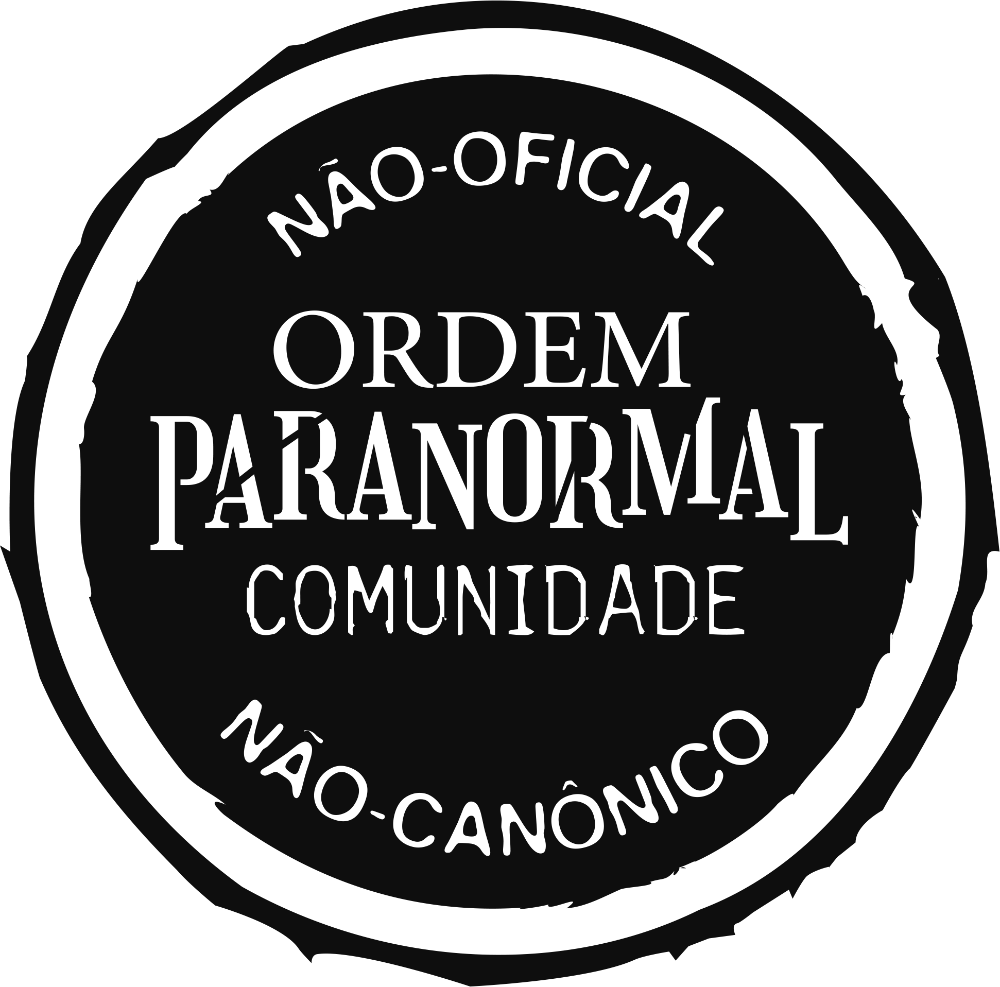

# Ordem Paranormal RPG — Sistema para Foundry VTT (v12)

> **Este é um conteúdo não oficial, publicado sob a [Licença da Comunidade de Ordem Paranormal](https://ordemparanormal.com.br/licenca).**
> *Ordem Paranormal RPG* é propriedade da Jambô Editora / Cellbit. Não afiliado, patrocinado ou aprovado por eles.
> Os compêndios são distribuídos **vazios** — adicione apenas conteúdo original/homebrew de sua autoria.

Sistema **não oficial** de RPG de investigação e terror paranormal para **Foundry VTT v12**.

> ⚠️ **Em desenvolvimento.** Use como versão inicial de testes e valide numa instalação local antes de usar em mesa.

---

## 📥 Instalação

### Opção 1 — Por Manifest URL (recomendado)

1. No Foundry, vá em **Configuration / Setup → Game Systems → Install System**.
2. No campo **Manifest URL**, cole exatamente:

   `https://github.com/riola-devlop/ordem-paranormal-system/releases/latest/download/system.json`

3. Clique em **Install**. O Foundry baixa e instala automaticamente.

> Se aparecer o erro `Cannot read properties of null (reading 'id')`, a URL do manifest está errada/inacessível (404). Confira que colou a URL **exatamente** como acima. Não instale por cima de uma cópia manual já existente (apague a pasta antes).

### Opção 2 — Instalação manual (cópia de arquivos)

O Foundry detecta sistemas lendo o `system.json` de cada pasta em `Data/systems/`. A pasta **precisa ter o mesmo nome do `id`** do sistema — aqui, `ordem-paranormal`.

1. Localize a pasta de dados do Foundry (**User Data**): no menu inicial, *Configuration → User Data Path*. Dentro dela há `Data/systems/`.
2. Copie a pasta do sistema para lá, ficando:
   `…/Data/systems/ordem-paranormal/`
   (confirme que existe `…/ordem-paranormal/system.json`).
3. O nome da pasta tem de ser **exatamente** `ordem-paranormal` (igual ao `id`).
4. **Reinicie o Foundry** (feche e abra o servidor) para detectá-lo.
5. Em **Game Systems**, o sistema **Ordem Paranormal RPG** aparece na lista.

### Criar um mundo com o sistema

1. Aba **Game Worlds → Create World**.
2. Em **Game System**, escolha **Ordem Paranormal RPG**.
3. Dê um nome e clique em **Create World → Launch World**.

### Requisitos

- **Foundry VTT v12** (testado e verificado na v12).
- Idioma: **Português (Brasil)**.
- Opcional: *Dice So Nice!* para dados 3D.

### Não aparece na lista? / Erros comuns

- O nome da pasta não bate com o `id` (`ordem-paranormal`).
- Faltou reiniciar o servidor após copiar os arquivos.
- `system.json` inválido ou incompleto — confira se o arquivo está íntegro.
- Ao atualizar: mudanças em `system.json`, `template.json` ou compêndios exigem **reiniciar o servidor** (para recarregar só a interface, use **F5**).

---

## 🚀 Primeiros passos

1. **Crie um Agente**: aba **Atores → Create Actor → tipo `Agente`**. Abra a ficha.
2. Preencha **Origem**, **Classe**, **Trilha**, **Patente** e os **5 atributos** (pentágono).
3. Ajuste o **NEX** (canto superior da ficha). Use **Subir NEX** para evoluir com o assistente.
4. Adicione **armas, proteções, poderes, rituais e equipamentos** pelas abas (botão **+**).
5. **Criaturas/NPCs**: **Create Actor → tipo `Criatura`** — statblock com o mesmo visual.
6. **Clique para rolar**: clique num atributo (pentágono) ou numa perícia para abrir o diálogo de teste.

---

## 📖 Documentação completa

O manual detalhado do sistema está em **[DOCUMENTATION.md](DOCUMENTATION.md)**:

- **[Modo de regras](DOCUMENTATION.md#modo-de-regras-padrão--sobrevivendo-ao-horror)** (Padrão ↔ Sobrevivendo ao Horror)
- **[Guia de uso](DOCUMENTATION.md#guia-de-uso)** — ficha, rolagens, combate, condições, morte, sanidade, rituais, progressão (NEX)
- **[Ferramentas do Mestre](DOCUMENTATION.md#ferramentas-do-mestre)** — Pedir Teste, Testes Estendidos, Investigação, Criaturas
- **[Conteúdo e compartilhamento](DOCUMENTATION.md#conteúdo-e-compartilhamento)** — Criador de Itens, Compêndios, sincronização via GitHub
- **[Fórmulas `@status`](DOCUMENTATION.md#fórmulas-status--dados)**, **[Referência rápida](DOCUMENTATION.md#referência-rápida)** e **[API](DOCUMENTATION.md#api-para-macros-e-console)**
- **[Estrutura de arquivos](DOCUMENTATION.md#estrutura-de-arquivos-desenvolvimento)** (desenvolvimento)

---

## 📜 Licença e conteúdo

- Sistema **não oficial**, sob a [Licença da Comunidade de Ordem Paranormal](https://ordemparanormal.com.br/licenca). Resumo e regras em **[licença.md](licença.md)** · aviso em **[LICENSE](LICENSE)**.
- Os compêndios vêm **vazios**. Adicione **apenas** conteúdo original/homebrew de sua autoria — não reproduza textos, imagens ou estatísticas dos livros oficiais.
- O selo da licença também é exibido dentro do sistema em **Configurações → Sobre / Licença**.

---

> Sistema não oficial, feito pela comunidade. *Ordem Paranormal RPG* é propriedade da Jambô Editora / Cellbit.
